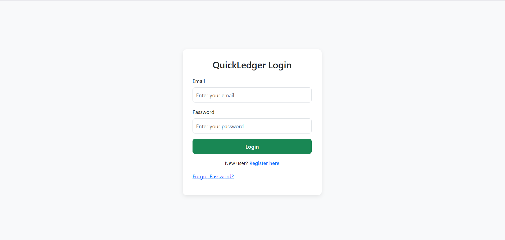
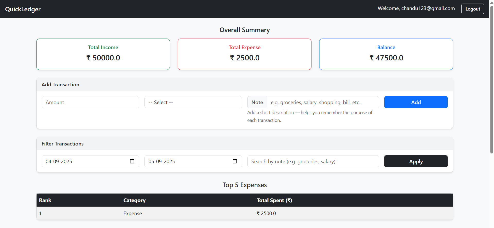

#  QuickLedger – Personal Finance Tracker

QuickLedger is a simple personal finance tracker that helps you manage income, expenses, and balance with filters and export options.

---

## 🚀 Features
- 🔐 User Authentication (Login/Register)
- ➕ Add / Delete Transactions
- 📊 Summaries – Income, Expense, Balance
- 🔎 Filters – by Date & Category
- 📑 Export Reports (CSV & PDF)

---

## 🛠 Tech Stack
- **Backend**: Python (Flask)
- **Database**: MySQL
- **Frontend**: HTML, CSS, Bootstrap
- **Libraries**: SQLAlchemy, ReportLab

---

## 📸 Screenshots
(Add your screenshots here)
🔐 Login Page

### 📊 Dashboard

---

## ⚙️ Installation
Clone the repo:

git clone https://github.com/chandan715/QuickLedger.git
cd QuickLedger
Create virtual environment & install dependencies:

python -m venv venv
venv\Scripts\activate   # On Windows
source venv/bin/activate  # On Mac/Linux
pip install -r requirements.txt

Run the app:
python app.py