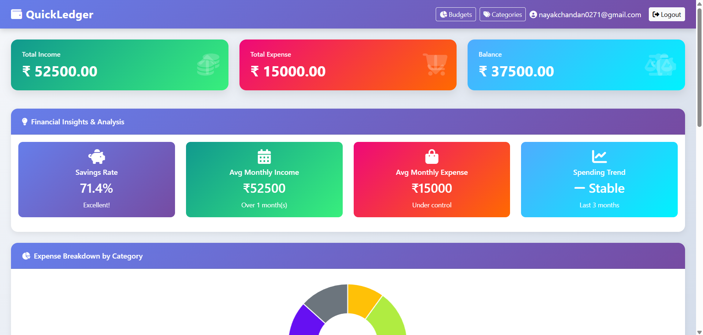
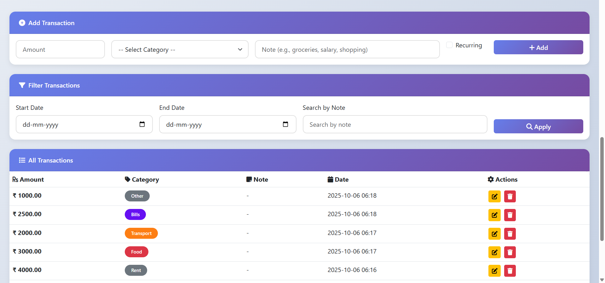

# 💰 QuickLedger – Personal Finance Tracker

<div align="center">


**A modern, feature-rich personal finance management application built with Flask**

[](https://www.python.org/)
[](https://flask.palletsprojects.com/)
[](https://www.mysql.com/)
[](LICENSE)

[Features](#-features) • [Demo](#-screenshots) • [Installation](#-installation) • [Usage](#-usage) • [API](#-api-endpoints)

</div>

---

## 🌟 Features

### 💳 Transaction Management
- ✅ Add, edit, and delete income/expense transactions
- 🔄 Support for recurring transactions (monthly bills, salary, etc.)
- 🏷️ Custom category system with color coding
- 📝 Transaction notes for better tracking
- 🔍 Advanced filtering by date range and notes
- 📊 Real-time balance calculation

### 📈 Data Visualization
- 🥧 **Interactive Pie Chart** - Expense breakdown by category
- 📉 **Line Chart** - Income vs Expense trends over time
- 🎨 **Color-coded Categories** - Visual distinction for easy identification
- 📱 **Responsive Charts** - Built with Chart.js for smooth interactions

### 💰 Budget Management
- 🎯 Set monthly budgets per category
- 📊 Real-time progress tracking with visual indicators
- ⚠️ Color-coded alerts (Green < 50%, Yellow < 80%, Red ≥ 80%)
- 💡 Budget vs actual spending comparison

### 🏷️ Category Management
- ➕ Create custom income and expense categories
- 🎨 Assign unique colors to each category
- 🗑️ Delete unused categories (with safety checks)
- 📦 Pre-loaded default categories for new users

### 🔐 Security & Authentication
- 🔒 Secure password hashing (pbkdf2:sha256)
- 📧 Email-based password reset functionality
- 🔑 Session management with configurable expiry
- 🛡️ Environment variable configuration for sensitive data
- ✅ Input validation and sanitization

### 📤 Export & Reporting
- 📄 **PDF Export** - Professional transaction reports
- 📊 **CSV Export** - Data export for Excel/Google Sheets
- 📧 **Email Reports** - Send reports via email (configurable)

### 🎨 Modern UI/UX
- 🌈 Beautiful gradient designs and animations
- 📱 Fully responsive (mobile, tablet, desktop)
- ⚡ Smooth transitions and hover effects
- 🔔 Toast notifications for user feedback
- 🎯 Intuitive navigation and user flow
- 🌙 Clean, professional interface

---

## 📸 Screenshots

### 🔐 Login Page


### 📊 Dashboard



*More screenshots coming soon!*

---

## 🛠 Tech Stack

| Technology | Purpose |
|------------|---------|
| **Backend** | Python 3.8+, Flask 3.1.0 |
| **Database** | MySQL 8.0+ |
| **Frontend** | HTML5, CSS3, Bootstrap 5.3 |
| **Charts** | Chart.js 4.4 |
| **Icons** | Font Awesome 6.4 |
| **PDF Generation** | ReportLab |
| **Email** | Flask-Mail |

---

## 📋 Prerequisites

Before you begin, ensure you have the following installed:

- **Python 3.8 or higher**
- **MySQL 8.0 or higher**
- **pip** (Python package manager)
- **Git** (for cloning the repository)

---

## ⚙️ Installation

### 1️⃣ Clone the Repository

```bash
git clone https://github.com/chandan715/QuickLedger.git
cd QuickLedger
```

### 2️⃣ Create Virtual Environment

**Windows:**
```bash
python -m venv venv
venv\Scripts\activate
```

**Mac/Linux:**
```bash
python3 -m venv venv
source venv/bin/activate
```

### 3️⃣ Install Dependencies

```bash
pip install -r requirements_clean.txt
```

### 4️⃣ Set Up MySQL Database

1. **Create Database:**
```sql
CREATE DATABASE quickledger;
```

2. **Create MySQL User (Optional but recommended):**
```sql
CREATE USER 'quickledger_user'@'localhost' IDENTIFIED BY 'your_secure_password';
GRANT ALL PRIVILEGES ON quickledger.* TO 'quickledger_user'@'localhost';
FLUSH PRIVILEGES;
```

### 5️⃣ Configure Environment Variables

1. **Copy the example environment file:**
```bash
cp .env.example .env
```

2. **Edit `.env` file with your settings:**
```env
# Database Configuration
DB_USERNAME=root
DB_PASSWORD=your_mysql_password
DB_HOST=localhost
DB_NAME=quickledger

# Flask Configuration
SECRET_KEY=your_secret_key_here_use_secrets_token_hex
FLASK_ENV=development

# Email Configuration (Optional - for password reset)
MAIL_SERVER=smtp.gmail.com
MAIL_PORT=587
MAIL_USE_TLS=True
MAIL_USERNAME=your_email@gmail.com
MAIL_PASSWORD=your_app_password
```

**🔑 Generate a secure SECRET_KEY:**
```python
import secrets
print(secrets.token_hex(32))
```

### 6️⃣ Initialize Database

The application will automatically create tables on first run. Alternatively, you can run:

```python
from app import app, db
with app.app_context():
    db.create_all()
```

### 7️⃣ Run the Application

```bash
python app.py
```

The application will be available at: **http://localhost:5000**

---

## 🚀 Usage

### First Time Setup

1. **Register an Account**
   - Navigate to http://localhost:5000
   - Click "Register here"
   - Enter email and password (min 6 chars, must include letters and numbers)
   - Default categories will be created automatically

2. **Login**
   - Use your registered credentials
   - You'll be redirected to the dashboard

### Adding Transactions

1. Go to Dashboard
2. Fill in the "Add Transaction" form:
   - **Amount**: Transaction value
   - **Category**: Select from your categories
   - **Note**: Optional description
   - **Recurring**: Check if it's a recurring transaction
3. Click "Add"

### Managing Budgets

1. Click "Budgets" in the navbar
2. Set budget for a category:
   - Select category
   - Enter budget amount
   - Choose month and year
3. View progress bars showing spending vs budget

### Managing Categories

1. Click "Categories" in the navbar
2. Add new category:
   - Enter category name
   - Select type (Income/Expense)
   - Choose a color
3. Delete unused categories (only if not used in transactions)

### Exporting Data

- **CSV Export**: Click "Export CSV" button on dashboard
- **PDF Export**: Click "Export PDF" button for formatted report

---

## 🔌 API Endpoints

### Chart Data APIs

#### Get Expense Breakdown
```http
GET /api/expense-breakdown
```
**Response:**
```json
{
  "labels": ["Food", "Transport", "Shopping"],
  "data": [5000, 2000, 3000],
  "colors": ["#dc3545", "#fd7e14", "#e83e8c"]
}
```

#### Get Income vs Expense Trend
```http
GET /api/income-expense-trend
```
**Response:**
```json
{
  "labels": ["Jan 2025", "Feb 2025", "Mar 2025"],
  "income": [50000, 55000, 52000],
  "expense": [30000, 35000, 32000]
}
```

---

## 📁 Project Structure

```
QuickLedger/
├── app.py                  # Main application file
├── config.py              # Configuration management
├── requirements_clean.txt # Python dependencies
├── .env.example          # Environment variables template
├── .gitignore            # Git ignore rules
├── README.md             # This file
├── templates/            # HTML templates
│   ├── dashboard.html
│   ├── login.html
│   ├── register.html
│   ├── edit_transaction.html
│   ├── budgets.html
│   ├── categories.html
│   ├── forgot_password.html
│   └── reset_password.html
├── screenshots/          # Application screenshots
└── venv/                # Virtual environment (not in git)
```

---

## 🔒 Security Best Practices

1. **Never commit `.env` file** - Contains sensitive credentials
2. **Use strong SECRET_KEY** - Generate with `secrets.token_hex(32)`
3. **Change default passwords** - Update MySQL and admin passwords
4. **Enable HTTPS in production** - Set `SESSION_COOKIE_SECURE = True`
5. **Regular backups** - Backup your database regularly
6. **Update dependencies** - Keep packages up to date

---

## 🐛 Troubleshooting

### Database Connection Error
```
Error: Can't connect to MySQL server
```
**Solution:** 
- Ensure MySQL is running
- Check credentials in `.env` file
- Verify database exists

### Import Error: No module named 'flask'
```
ModuleNotFoundError: No module named 'flask'
```
**Solution:**
```bash
pip install -r requirements_clean.txt
```

### Port Already in Use
```
OSError: [Errno 48] Address already in use
```
**Solution:**
- Change port in `app.py`: `app.run(debug=True, port=5001)`
- Or kill the process using port 5000

---

## 🚀 Deployment

### Production Checklist

- [ ] Set `FLASK_ENV=production` in `.env`
- [ ] Use a production WSGI server (Gunicorn, uWSGI)
- [ ] Enable HTTPS
- [ ] Set secure session cookies
- [ ] Configure proper database backups
- [ ] Set up monitoring and logging
- [ ] Use environment-specific configuration

### Deploy with Gunicorn

```bash
pip install gunicorn
gunicorn -w 4 -b 0.0.0.0:8000 app:app
```

---

## 🤝 Contributing

Contributions are welcome! Please follow these steps:

1. Fork the repository
2. Create a feature branch (`git checkout -b feature/AmazingFeature`)
3. Commit your changes (`git commit -m 'Add some AmazingFeature'`)
4. Push to the branch (`git push origin feature/AmazingFeature`)
5. Open a Pull Request

---

## 📝 License

This project is licensed under the MIT License - see the [LICENSE](LICENSE) file for details.

---

## 👨‍💻 Author

**Chandan**

- GitHub: [@chandan715](https://github.com/chandan715)
- Project: [QuickLedger](https://github.com/chandan715/QuickLedger)

---

## 🙏 Acknowledgments

- Flask framework and community
- Bootstrap for responsive design
- Chart.js for beautiful visualizations
- Font Awesome for icons
- All contributors and users

---

## 📧 Support

If you have any questions or need help, please:

1. Check the [Troubleshooting](#-troubleshooting) section
2. Open an issue on GitHub
3. Contact via email (if provided)

---

<div align="center">

**⭐ Star this repository if you find it helpful!**

Made by Chandan.

</div>
